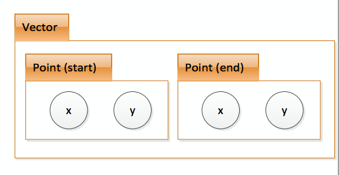

## Classes of classes

As we have explained in the beginning example:a point consists of an x and y
coordinate and a vector consists of 2 points: a
start and a finish.
So the scheme is the following:



```cpp
class Point {
public:
 double x;
 double y;
};
class Vector {
public:
 Point start;
 Point end;
};
```
So fields can be classes.
Note the order in which classes are defined.
To access the fields we should do the following:

```cpp
class Point {
public:
 double x, y;
};
class Vector {
public:
 Point start, end;
};
int main() {
 Vector vec1;// define vec1 of Vector class
vec1.start.x = 3.0;
 vec1.start.y = 4.0;
 vec1.end.x = 5.0;
 vec1.end.y = 6.0;
}
```

You can also assign one instance to another, that means copy all fields.
```cpp
vec2.start = vec1.start;
```
