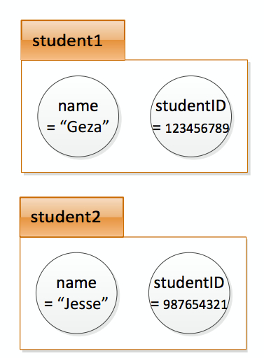

## Instances

An instance is an occurrence of a class.
Different instances can have their own set of
values in their fields.
If we continue the example shown before:
```cpp

class MITStudent {
public:
 char *name;
 int studentID;
};

```
Now, if you wanted to represent 2 different
students (who can have different names and
IDs), you would use 2 instances of MITStudent.
So we define 2 instances of MITStudent: one called
student1, the other called student2.

```cpp
class MITStudent {
public:
 char *name;
 int studentID;
};
int main() {
 MITStudent student1;
MITStudent student2;
}
```
To access fields of instances, use
`variable.fieldName`.

```
#include <iostream>
using namespace std;

class MITStudent {
 public:
  char *name;
  int studentID;
};

int main() {
   MITStudent student1;
   MITStudent student2;
    student1.name = "Geza";
    student1.studentID = 123456789;
    student2.name = "Jesse";
    student2.studentID = 987654321;

 cout << "student1 name is" << student1.name << endl;
 cout << "student1 id is" << student1.studentID << endl;
 cout << "student2 name is" << student2.name << endl;
 cout << "student2 id is" << student2.studentID << endl;


return 0;
}
```



