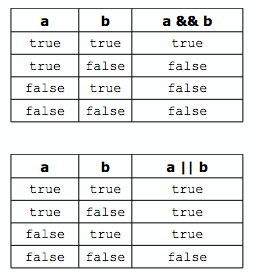
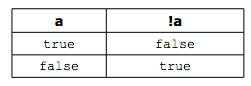

## Operators

Conditionals(*if statements*) use two kinds of special operators: relational and logical. These are used to
determine whether some condition is true or false.

######Relational Operators

The relational operators are used to test a relation between two expressions:

|**Operator**| **Meaning**|
|--|--|
|> |Greater than|
|>= |Greater than or equal to |
|< |Less than |
|<= |Less than or equal to |
|== |Equal to |
|!= |Not equal to |

They work the same as the arithmetic operators (e.g., a > b) but return a Boolean value of
either true or false, indicating whether the relation tested for holds. (An expression that
returns this kind of value is called a Boolean expression.) For example, if the variables x and y
have been set to 6 and 2, respectively, then x > y returns true. Similarly, x < 5 returns
false.

######Logical Operators

The logical operators are often used to combine relational expressions into more complicated
Boolean expressions:

|**Operator**|**Meaning**|
|--|--|
|&&| and |
|*double pipe* |or |
|! |not |

The `and` and `or` operators return true or false, according to the rules of logic:

The `not` operator is a unary operator, taking only one argument and negating its value:

Of course, Boolean variables can be used directly in these expressions, since they hold true
and false values. In fact, any kind of value can be used in a Boolean expression due to a
quirk C++ has: false is represented by a value of 0 and anything that is not 0 is true. So,
“Hello, world!” is true, 2 is true, and any int variable holding a non-zero value is true. This
means !x returns false and x && y returns true.

