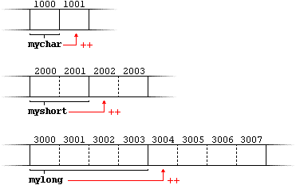

## Pointers and their behavior

Variables are explained as locations in the computer's memory which can be accessed by their identifier (their name). This way, the program does not need to care about the physical address of the data in memory; it simply uses the identifier whenever it needs to refer to the variable.

For a C++ program, the memory of a computer is like a succession of memory cells, each one byte in size, and each with a unique address. These single-byte memory cells are ordered in a way that allows data representations larger than one byte to occupy memory cells that have consecutive addresses.

This way, each cell can be easily located in the memory by means of its unique address. For example, the memory cell with the address 1776 always follows immediately after the cell with address 1775 and precedes the one with 1777, and is exactly one thousand cells after 776 and exactly one thousand cells before 2776.

When a variable is declared, the memory needed to store its value is assigned a specific location in memory (its memory address). Generally, C++ programs do not actively decide the exact memory addresses where its variables are stored. It may be useful for a program to be able to obtain the address of a variable during runtime in order to access data cells that are at a certain position relative to it.

Pointers are just variables storing integers, that happend to be memory addresses. We can acces the value of a variable deferencing the pointer.

